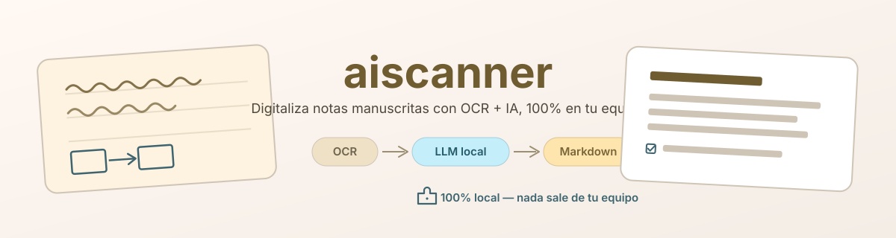

<p align="center">
  
</p>

<p align="center">
  
  
  
</p>

# aiscanner

Escáner de notas manuscritas 100% local: combina [PaddleOCR](https://github.com/PaddlePaddle/PaddleOCR)
para extraer el texto con un LLM multimodal corriendo en [Ollama](https://ollama.com) para
corregir errores de OCR, reconstruir la estructura del documento y generar Markdown editable —
incluyendo diagramas dibujados a mano, convertidos a [Mermaid](https://mermaid.js.org) y
renderizados como imagen. Nada de lo que escaneas sale de tu máquina.

📖 **Documentación completa**: guía de inicio detallada, arquitectura, referencia de API generada
desde los docstrings y el historial de cada feature — ver [Documentación](#documentación) abajo.

## Requisitos

- **Python 3.10 a 3.12** (paddlepaddle no publica wheels para 3.13+ todavía). Gestionado con
  [`uv`](https://docs.astral.sh/uv/).
- **[Ollama](https://ollama.com)** corriendo en `localhost:11434`, con al menos un modelo
  multimodal descargado:

  ```sh
  ollama pull gemma3:4b
  ```

- **GPU NVIDIA (opcional)**: acelera PaddleOCR si tienes CUDA Toolkit + cuDNN instalados a nivel
  de sistema (ver `pyproject.toml` para la versión exacta de `paddlepaddle-gpu`). Sin GPU,
  PaddleOCR corre en CPU sin configuración extra.
- **Node.js + npm**: obligatorio para compilar la interfaz web (`frontend/`, React + Vite), y para
  renderizar diagramas dibujados a mano vía `npx @mermaid-js/mermaid-cli` (si no está disponible,
  los diagramas quedan como código Mermaid en el Markdown en vez de imagen).
- **Pandoc** (opcional, solo para exportar a `.docx`): se descarga solo la primera vez que se usa
  `--docx`, vía `pypandoc`.

## Instalación

```sh
uv sync
```

## Uso por línea de comandos

```sh
uv run main.py <imagen1> [imagen2 ...] [-o salida.md] [--docx]
```

```sh
# Documento de varias páginas, con salida explícita y export a Word
uv run main.py notas/pag1.jpg notas/pag2.jpg -o notas/documento.md --docx
```

## Interfaz web

```sh
cd frontend && npm install && npm run build   # solo la primera vez, o si cambia frontend/
cd ..
uv run serve.py
```

Abre `http://127.0.0.1:8000`: **Cargar** documentos, **Explorador** de lo ya procesado, y
**Configuración** para elegir qué modelo de Ollama usa el digitalizador. Para acceso remoto (ej.
desde tu teléfono), usa [Tailscale](https://tailscale.com) — la interfaz no tiene autenticación
propia, así que **no** la expongas con un túnel público.

## Documentación

La documentación completa del proyecto vive en [MkDocs](https://www.mkdocs.org/) y se genera a
partir del propio código (docstrings numpydoc) y de las especificaciones versionadas de cada
feature (`specs/`), para que se mantenga sincronizada con lo que el código realmente hace:

```sh
uv run mkdocs serve
```

Abre `http://127.0.0.1:8001`. Incluye:

- **Guía de inicio** completa (requisitos, instalación, CLI, interfaz web, acceso remoto).
- **Arquitectura**: cómo fluye un documento de punta a punta, backend web, frontend.
- **Referencia de API**: documentación autogenerada de cada módulo Python.
- **Historial de features**: qué se construyó en cada iteración y por qué (specs de spec-kit).

`uv run mkdocs build` genera el sitio estático en `site/` para publicarlo donde quieras.
