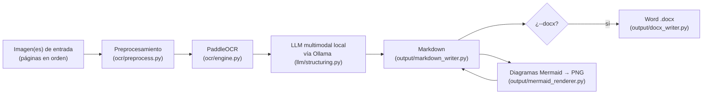
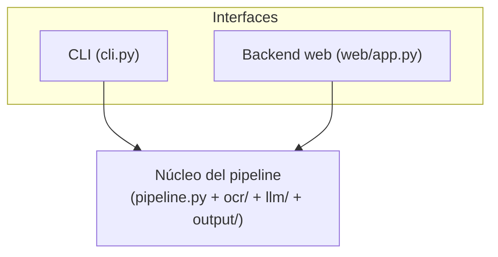

# Visión general de la arquitectura

## Flujo de datos de una digitalización



Todo esto lo orquesta [`pipeline.run_pipeline`](../reference/pipeline.md), una única función que
tanto la CLI (`cli.py`) como la cola de trabajos de la interfaz web
([`web.jobs.queue`](../reference/web/jobs.md)) invocan por igual — ver
[Pipeline](pipeline.md) para el detalle capa por capa.

## Dos interfaces, un solo núcleo



La CLI fue la primera interfaz; la interfaz web (React + Vite, ver
[Frontend web](frontend.md) y [Backend web](web-backend.md)) se agregó después **consumiendo el
mismo núcleo**, no reimplementando OCR/LLM/output por su cuenta. Este desacople es uno de los
principios de diseño no negociables del proyecto (ver más abajo).

## Principios de diseño

Extraídos de la constitución del proyecto (`.specify/memory/constitution.md`, v1.1.1) — la
referencia de gobernanza que toda tarea de implementación debe respetar:

1. **Privacidad y ejecución 100% local** — OCR e inferencia del LLM corren en la máquina del
   usuario; ningún documento, imagen o texto extraído sale hacia un servicio de red externo. El
   acceso remoto a la interfaz web es exclusivamente vía Tailscale/WireGuard (red privada punto a
   punto), nunca un túnel público.
2. **Núcleo desacoplado de la interfaz** — el pipeline vive separado de la CLI y de la interfaz
   web; cada capa (OCR, LLM, output) se expone detrás de una interfaz pequeña para poder cambiar
   de motor/backend/formato sin tocar el orquestador ni las demás capas.
3. **Principios SOLID en el diseño de clases** — responsabilidad única, abierto/cerrado,
   sustitución de Liskov, segregación de interfaces y dependencia hacia abstracciones (el
   orquestador depende de `PipelineRunner`, no de una implementación concreta).
4. **Documentación numpydoc/JSDoc obligatoria** — toda función y clase sustantiva tiene un
   docstring completo, en el formato idiomático de su lenguaje (numpydoc en Python, JSDoc en
   TypeScript/React), con el mismo nivel de detalle. Esta misma referencia de API
   ([Referencia de API](../reference/cli.md)) se genera directamente de esos docstrings.
5. **Comentarios que explican el porqué** — las decisiones no obvias (por qué se preprocesa así,
   por qué se eligió ese umbral, por qué el prompt tiene esa estructura) llevan un comentario que
   explica el razonamiento, no una traducción literal del código.
6. **Sin estado persistente entre ejecuciones** — cada corrida es `imagen(es) → Markdown`, sin
   base de datos, caché de sesión ni historial entre ejecuciones. Las imágenes originales nunca
   se modifican ni se sobrescriben. El explorador de la interfaz web (ver
   [Backend web](web-backend.md)) lista lo que ya existe en el sistema de archivos, sin mantener
   un índice propio.

## Módulos del proyecto

```text
src/
├── main.py, cli.py        # entry point de la CLI
├── pipeline.py             # orquesta: preprocess -> ocr -> llm -> output
├── config.py               # configuración local (OUTPUT_DIR, modelo activo)
├── ocr/                    # preprocesamiento + wrapper de PaddleOCR
├── llm/                    # cliente de Ollama, prompts, estructuración a Markdown
├── output/                 # escritura de Markdown/.docx, render de diagramas Mermaid
└── web/                    # backend FastAPI de la interfaz web
    ├── app.py               # construye la app y monta el frontend compilado
    ├── jobs/                # cola de trabajos en memoria (un job a la vez)
    ├── explorer/            # lista/organiza los documentos ya procesados
    └── routers/             # endpoints /api/jobs, /api/files, /api/models, /health

frontend/src/               # interfaz web (React + Vite, ver Frontend web)
```
